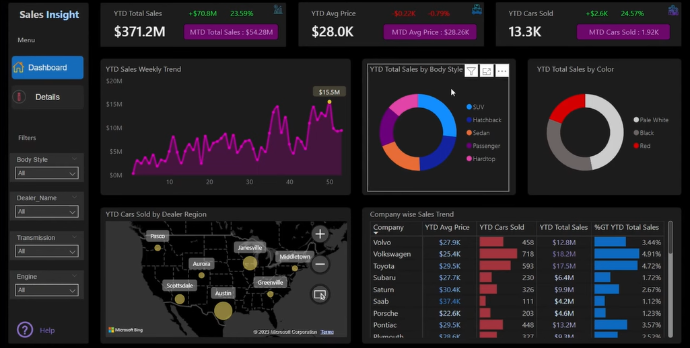

# 🚗 Automotive Sales Insight Dashboard

## 📌 Project Overview

This **Sales Insight Dashboard** is a dynamic, executive-level data product built using **Power BI** to track real-time performance across car sales, dealership activity, vehicle types, and regional trends.

The dashboard provides a complete **year-to-date (YTD)** and **month-to-date (MTD)** breakdown of key automotive KPIs including total sales revenue, units sold, average price fluctuations, and segmentation by **body style, color, brand, and dealer location**.

> 🔍 As seen in the image above, this dashboard combines **interactive filters**, **geo-intelligence**, and **sales diagnostics** in one sleek, dark-themed interface that highlights business-critical insights at a glance.

---

## 💡 Key Highlights

- **$371.2M** YTD Total Sales, with a 23.59% increase (+$70.8M YoY)
- **13.3K Cars Sold** YTD, with MTD growth of 24.57%
- **Live Price Tracking** shows avg. sale price at $28.0K
- **Weekly Sales Trend Line** peaking at $15.5M reveals seasonal performance cycles
- **Donut Charts** reveal sales dominance by SUVs and Hatchbacks, and color preferences led by Pale White
- **Dealer Region Mapping** (Austin, Scottsdale, Greenville, etc.) shows market penetration by location
- **Company-wise Trend Table** compares top OEMs (Toyota, Subaru, Volkswagen, Volvo, etc.) on avg. price vs units sold vs total revenue

---

## 📊 Dashboard Components

| Visual | Description |
|--------|-------------|
| 🟣 **Weekly Trend Line** | Tracks week-by-week revenue fluctuations |
| 🗂 **Sales by Body Style & Color** | Donut charts reveal customer preferences |
| 🗺️ **Map of Dealer Sales** | Geo-visual of YTD cars sold by dealer region |
| 🏢 **OEM Sales Table** | Breakdown by company: average price, volume, and contribution |
| 🔄 **Interactive Filters** | Body style, transmission, engine type, and dealer filters |

---

## 🛠 Tools & Technologies

- **Power BI Desktop** – Dashboard development and DAX
- **Power Query** – ETL and data transformation
- **Microsoft Bing Maps Visual** – Dealer-level mapping
- **Excel / CSV** – Initial data input
- **DAX Measures** – Time-based KPIs, growth rates, trends

---

## ✅ Skills Demonstrated

- 📉 Sales Performance Monitoring  
- 🧩 Data Modeling & Relationships  
- 📍 Regional Sales Analytics  
- 🏷 Product Segmentation & Visual Filtering  
- 📊 Executive Dashboard Design  
- 🧠 Insight-Driven Storytelling  
- 💡 Real-Time KPI Benchmarking

---

## 👨‍💼 About Me

I’m **Tosin Bello**, a **Data Analyst and Data Scientist** with a deep passion for building data tools that drive business clarity and performance. My dashboards turn raw numbers into **actionable business strategies** — aligning with C-suite needs and operational goals.

📬 **Let’s Connect**:

- **LinkedIn**: [Tosin Bello](https://www.linkedin.com/in/tosinbellofin)
- **Email**: toshineb@email.com

---

## ⭐ Enjoyed this dashboard? Star the repo and follow for more high-impact analytics projects.
